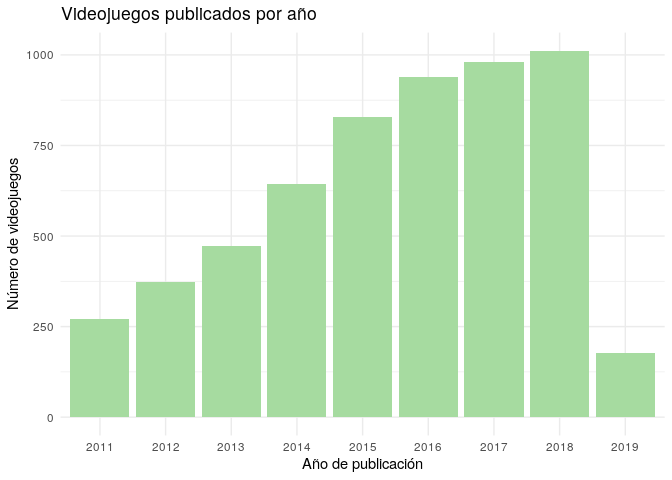
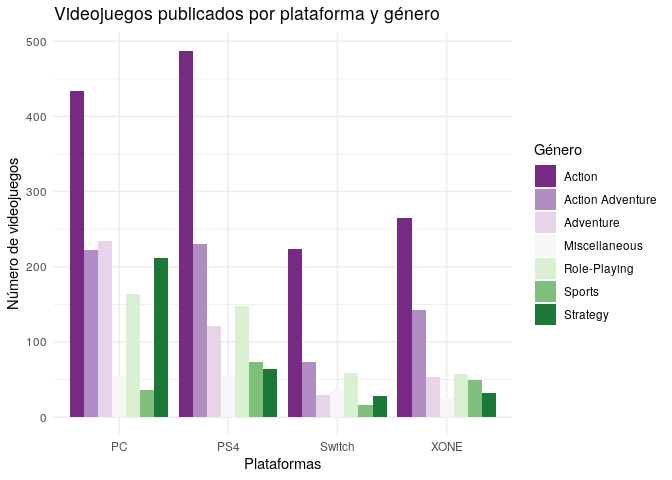

Videojuegos
================
Irene Perez
12/5/2020

## Metacritic games stats 2011-2019

Los datos se obtuvieron de
[Kaggle](https://www.kaggle.com/skateddu/metacritic-games-stats-20112019/data)
y están disponibles en dicha plataforma. Metacritic es una página web
que recoge opiniones de películas, series de televisión, álbumes de
música y videojuegos. El dataset contiene una variedad de estadísticas
desde enero de 2011 hasta marzo de 2019. Todos los gráficos mostrados a
continuación siguen paletas “Colorblind safe” o aptas para daltónicos.

### Videojuegos publicados por año

En el dataset se recoge un total de 5699 videojuegos diferentes. Para
analizar la evolución de la industria de los videojuegos, he decidido
hacer un gráfico representando los videojuegos disponibles en la base de
datos por su año de publicación.

``` r
kable(videogames[1:5,])
```

<table>

<thead>

<tr>

<th style="text-align:left;">

game

</th>

<th style="text-align:left;">

platform

</th>

<th style="text-align:left;">

developer

</th>

<th style="text-align:left;">

genre

</th>

<th style="text-align:left;">

number\_players

</th>

<th style="text-align:left;">

rating

</th>

<th style="text-align:left;">

release\_date

</th>

<th style="text-align:right;">

positive\_critics

</th>

<th style="text-align:right;">

neutral\_critics

</th>

<th style="text-align:right;">

negative\_critics

</th>

<th style="text-align:right;">

positive\_users

</th>

<th style="text-align:right;">

neutral\_users

</th>

<th style="text-align:right;">

negative\_users

</th>

<th style="text-align:right;">

metascore

</th>

<th style="text-align:right;">

user\_score

</th>

</tr>

</thead>

<tbody>

<tr>

<td style="text-align:left;">

Portal 2

</td>

<td style="text-align:left;">

PC

</td>

<td style="text-align:left;">

Valve Software

</td>

<td style="text-align:left;">

Action

</td>

<td style="text-align:left;">

</td>

<td style="text-align:left;">

E10+

</td>

<td style="text-align:left;">

Apr 18, 2011

</td>

<td style="text-align:right;">

51

</td>

<td style="text-align:right;">

1

</td>

<td style="text-align:right;">

0

</td>

<td style="text-align:right;">

1700

</td>

<td style="text-align:right;">

107

</td>

<td style="text-align:right;">

19

</td>

<td style="text-align:right;">

95

</td>

<td style="text-align:right;">

90

</td>

</tr>

<tr>

<td style="text-align:left;">

The Elder Scrolls V: Skyrim

</td>

<td style="text-align:left;">

PC

</td>

<td style="text-align:left;">

Bethesda Game Studios

</td>

<td style="text-align:left;">

Role-Playing

</td>

<td style="text-align:left;">

No Online Multiplayer

</td>

<td style="text-align:left;">

M

</td>

<td style="text-align:left;">

Nov 10, 2011

</td>

<td style="text-align:right;">

32

</td>

<td style="text-align:right;">

0

</td>

<td style="text-align:right;">

0

</td>

<td style="text-align:right;">

1616

</td>

<td style="text-align:right;">

322

</td>

<td style="text-align:right;">

451

</td>

<td style="text-align:right;">

94

</td>

<td style="text-align:right;">

82

</td>

</tr>

<tr>

<td style="text-align:left;">

The Legend of Zelda: Ocarina of Time 3D

</td>

<td style="text-align:left;">

3DS

</td>

<td style="text-align:left;">

GREZZO

</td>

<td style="text-align:left;">

Miscellaneous

</td>

<td style="text-align:left;">

No Online Multiplayer

</td>

<td style="text-align:left;">

E10+

</td>

<td style="text-align:left;">

Jun 19, 2011

</td>

<td style="text-align:right;">

84

</td>

<td style="text-align:right;">

1

</td>

<td style="text-align:right;">

0

</td>

<td style="text-align:right;">

283

</td>

<td style="text-align:right;">

20

</td>

<td style="text-align:right;">

5

</td>

<td style="text-align:right;">

94

</td>

<td style="text-align:right;">

90

</td>

</tr>

<tr>

<td style="text-align:left;">

Batman: Arkham City

</td>

<td style="text-align:left;">

PC

</td>

<td style="text-align:left;">

Rocksteady Studios

</td>

<td style="text-align:left;">

Action Adventure

</td>

<td style="text-align:left;">

</td>

<td style="text-align:left;">

T

</td>

<td style="text-align:left;">

Nov 21, 2011

</td>

<td style="text-align:right;">

27

</td>

<td style="text-align:right;">

0

</td>

<td style="text-align:right;">

0

</td>

<td style="text-align:right;">

240

</td>

<td style="text-align:right;">

34

</td>

<td style="text-align:right;">

27

</td>

<td style="text-align:right;">

91

</td>

<td style="text-align:right;">

87

</td>

</tr>

<tr>

<td style="text-align:left;">

Super Mario 3D Land

</td>

<td style="text-align:left;">

3DS

</td>

<td style="text-align:left;">

Nintendo

</td>

<td style="text-align:left;">

Action

</td>

<td style="text-align:left;">

No Online Multiplayer

</td>

<td style="text-align:left;">

E

</td>

<td style="text-align:left;">

Nov 13, 2011

</td>

<td style="text-align:right;">

81

</td>

<td style="text-align:right;">

1

</td>

<td style="text-align:right;">

0

</td>

<td style="text-align:right;">

251

</td>

<td style="text-align:right;">

39

</td>

<td style="text-align:right;">

11

</td>

<td style="text-align:right;">

90

</td>

<td style="text-align:right;">

84

</td>

</tr>

</tbody>

</table>

``` r
videogames <- separate(videogames,
                       col = "release_date",
                       into = c("month_day", "year"),
                       sep = ", ")

videogames_year = as.data.frame(table(videogames$year))
names(videogames_year) = c("Year", "Freq")

ggplot(data=videogames_year, aes(x=Year, y=Freq)) +
  geom_bar(stat = "identity", fill= "#A6DBA0") +
  labs(x="Año de publicación", y="Número de videojuegos") +
  ggtitle("Videojuegos publicados por año") +
  theme_minimal()
```

<!-- -->

### Videojuegos por plataforma y género

En el dataset hay un total de 54 géneros diferentes, con entre 1 y 1846
entradas cada uno. Para mantener sólo los géneros más populares, he
aplicado un filtro de 200 entradas como mínimo, de forma que sólo
aquellos géneros con más de 200 videojuegos asociados se mantienen:

Action, Action Adventure, Adventure, Miscellaneous, Role-Playing,
Sports, Strategy

También he eliminado del análisis plataformas obsoletas como la 3DS,
VITA y WIIU, y he filtrado

Si analizamos toda la base de datos, obtenemos los videojuegos por
plataforma y género acumulados desde 2011. Sin embargo, tanto la PS4
como Xbox ONE fueron lanzadas al mercado en noviembre de 2013, por lo
que los juegos anteriores a esa fecha se han mantenido fuera de este
análisis.

``` r
plataforma_genero <- videogames %>% count(platform, genre)
plataforma_genero$platform <- droplevels(plataforma_genero$platform)
plataforma_genero <- as.data.frame(plataforma_genero)

ggplot(data=plataforma_genero, aes(x=platform, y=n, fill=genre)) +
  geom_bar(stat = "identity", position=position_dodge()) +
  scale_fill_brewer(palette ="PRGn") +
  labs(x="Plataformas", y="Número de videojuegos", fill="Género") +
  ggtitle("Videojuegos publicados por plataforma y género") +
  theme_minimal()
```

<!-- -->

Los géneros más populares son Acción, Aventuras y/o una combinación de
ambos en todas las plataformas. Las plataformas que más variedad de
videojuegos tienen en su catálogo son PC y PS4. A penas se publican
juegos de estrategia para plataformas que no sean PC, probablemente
debido a cómo afecta a la jugabilidad de estos videojuegos no poder usar
teclado y ratón. La plataforma para la que más juegos de deporte se
publican es PS4, y es a su vez el género para el que menos juegos se
publican en PC y Switch. Aunque la Switch es la plataforma con menos
videojuegos acumulados desde 2013, es importante tener en cuenta que fue
lanzada al mercado en marzo de 2017 y ya tiene unos niveles de
videojuegos acumulados similares a los de la XONE: 467 en la Switch
frente a 626 en la XONE.
