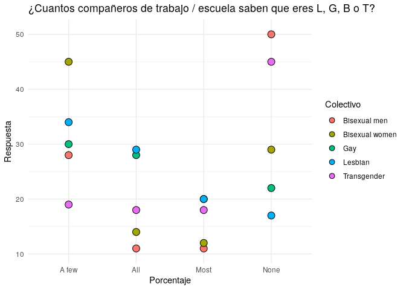
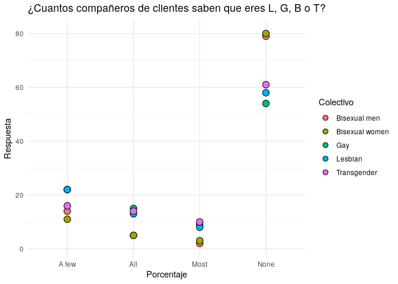
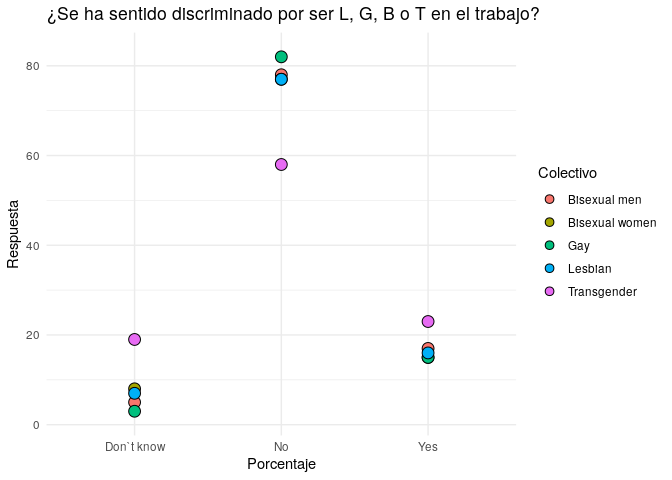

EU LGBT Survey
================
Irene Perez
13/5/2020

## Encuentras sobre el colectivo LGBT en el trabajo en España

Los datos se obtuvieron de
[Kaggle](https://www.kaggle.com/ruslankl/european-union-lgbt-survey-2012)
y estan disponibles en dicha plataforma. Estas encuestas fueron llevadas
a cabo por la FRA (Fundamental Rights Agency) de forma online para
identificar cómo se cumplen los derechos fundamentales en la unión
europea de lesbianas, gays, bisexuales y personas trans (LGBT).

En el dataset se incluyen preguntas de multitud de temáticas, pero he
decidido centrar el análisis en tres preguntas de ámbito laboral en
España.

``` r
lgbt_disc <- read.csv("../european-union-lgbt-survey-2012/LGBT_Survey_Discrimination.csv")
lgbt_daily <- read.csv("../european-union-lgbt-survey-2012/LGBT_Survey_DailyLife.csv")
```

### El armario y el trabajo

``` r
question <- "To how many people among the following groups are you open about yourself being L, G, B or T? Work colleagues / schoolmates?"
question2 <- lgbt_daily %>% filter(question_label == question) %>% filter(CountryCode == "Spain") 
question2$answer <- as.character(question2$answer)
question2$percentage <- as.numeric(levels(question2$percentage))[question2$percentage]
```

Los compañeros de trabajo / escuela del 50% de los hombres bisexuales no
sabe que lo son, ni el 45% en el caso de las personas trans. El conjunto
de los bisexuales son el colectivo que menos da a conocer a su entorno
laboral su sexualidad. Por otro lado, las lesbianas y los gays son los
más abiertos a hacerlo.

``` r
ggplot(question2, aes(x=answer, y=percentage, fill=subset)) +
  geom_dotplot(binaxis = "y", stackdir = "center") +
  xlab("Porcentaje") +
  ylab("Respuesta") +
  labs(fill = "Colectivo") +
  ggtitle("¿Cuantos compañeros de trabajo / escuela saben que eres L, G, B o T?") +
  theme_minimal()
```

<!-- -->

``` r
question <- "To how many people among the following groups are you open about yourself being L, G, B or T? Customers, clients, etc at work?"
question3 <- lgbt_daily %>% filter(question_label == question) %>% filter(CountryCode == "Spain") 
question3$answer <- as.character(question3$answer)
question3$percentage <- as.numeric(levels(question3$percentage))[question3$percentage]
```

Al analizar lo abierta que es la comunidad LGBT laboral a sus clientes,
los porcentajes cambian bastante. La mayoría de la comunidad LGBT no da
a conocer a ninguno de sus clientes su sexualidad, siendo de nuevo los
bisexuales el colectivo menos abierto.

``` r
ggplot(question3, aes(x=answer, y=percentage, fill=subset)) +
  geom_dotplot(binaxis = "y", stackdir = "center", binwidth = 2.5) +
  xlab("Porcentaje") +
  ylab("Respuesta") +
  labs(fill = "Colectivo") +
  ggtitle("¿Cuantos compañeros de clientes saben que eres L, G, B o T?") +
  theme_minimal()
```

<!-- -->

### Discriminación en el trabajo

``` r
question <- "During the last 12 months, have you personally felt discriminated against because of being L, G, B or T at work?"
question1 <- lgbt_disc %>% filter(question_label == question) %>% filter(CountryCode == "Spain") 
question1$answer <- as.character(question1$answer)
question1$percentage <- as.numeric(levels(question1$percentage))[question1$percentage]
```

La mayoría de gays, bisexuales (hombres y mujeres) y lesbianas no se ha
sentido discriminado por ser LGBT en el trabajo. También ocurre lo mismo
con el colectivo trans, pero en menor medida (58%). Este mismo grupo es
el que más discriminado se ha sentido, con un 23% de encuestados
respondiendo que sí.

``` r
ggplot(question1, aes(x=answer, y=percentage, fill=subset)) +
  geom_dotplot(binaxis = "y", stackdir = "center") +
  xlab("Porcentaje") +
  ylab("Respuesta") +
  labs(fill = "Colectivo") +
  ggtitle("¿Se ha sentido discriminado por ser L, G, B o T en el trabajo?") +
  theme_minimal()
```

<!-- -->

Aunque parece predominar la “no discriminación” en el trabajo dentro del
colectivo LGBT en España, hay que tener en cuenta que actualmente
alrededor del 20% del colectivo sí se siente discriminado por ser ellos
mismos en el ámbito laboral. Esta situación es especialmente preocupante
en las personas trans, ya que menos del 60% han contestado que no se
sienten discriminados.
