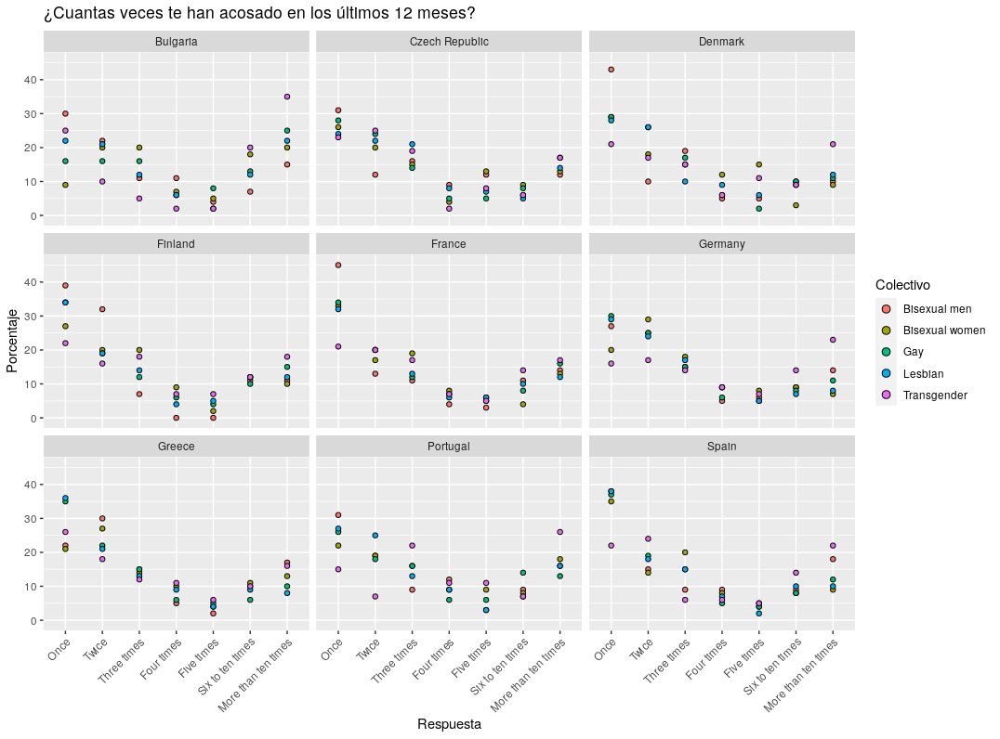
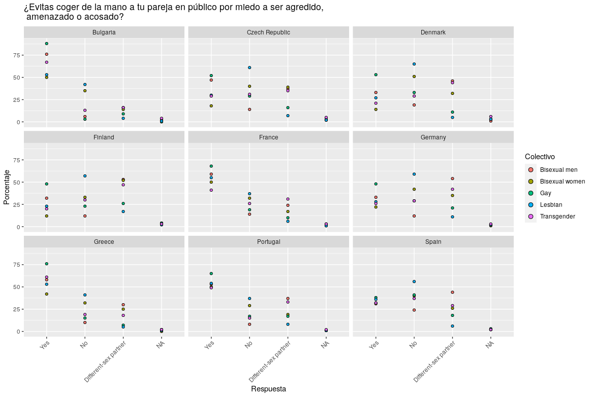

EU LGBT Survey
================
Irene Perez
13/5/2020

## Encuentras sobre violencia al colectivo LGBT en Europa

Los datos se obtuvieron de
[Kaggle](https://www.kaggle.com/ruslankl/european-union-lgbt-survey-2012)
y estan disponibles en dicha plataforma. Estas encuestas fueron llevadas
a cabo por la FRA (Fundamental Rights Agency) de forma online para
identificar cómo se cumplen los derechos fundamentales en la unión
europea de lesbianas, gays, bisexuales y personas trans (LGBT).

Aunque es el mismo dataset que para los diagramas de puntos, en esta
ocasión he cambiado el foco de las gráficas a la temática de la
violencia hacia el colectivo LGBT en diferentes países de la Unión
Europea: España, Bulgaria, República Checa, Dinamarca, Finlandia,
Alemania, Francia, Grecia y Portuga.

``` r
lgbt_violence <- read.csv("../european-union-lgbt-survey-2012/LGBT_Survey_ViolenceAndHarassment.csv")
countries <- c("Spain", "Bulgaria", "Czech Republic", "Denmark", "Finland", "Germany", "France", "Greece", "Portugal")
```

``` r
question <- "How many times did somebody harass you in the last 12 months?"
question2 <- lgbt_violence %>% filter(question_label == question) %>% filter(CountryCode %in% countries) 
question2$answer <- as.character(question2$answer)
question2$answer <- factor(question2$answer, levels = c("Once", "Twice", "Three times", "Four times", "Five times", "Six to ten times", "More than ten times"))
question2$percentage <- as.numeric(levels(question2$percentage))[question2$percentage]
```

``` r
ggplot(question2, aes(x=answer, y=percentage, fill=subset)) +
  geom_dotplot(binaxis = "y", stackdir = "center") +
  xlab("Respuesta") +
  ylab("Porcentaje") +
  labs(fill = "Colectivo") +
  ggtitle("¿Cuantas veces te han acosado en los últimos 12 meses?") +
  facet_wrap( ~CountryCode, ncol=3) +
  theme(axis.text.x = element_text(angle=45, hjust = 1))
```

<!-- -->

``` r
question <- "Do you avoid holding hands in public with a same-sex partner for fear of being assaulted, threatened of harassed?"
question1 <- lgbt_violence %>% filter(question_label == question) %>% filter(CountryCode %in% countries) 
question1$answer <- as.character(question1$answer)
question1$answer <- factor(question1$answer, levels = c("Yes", "No", "I do not have a same-sex partner", "Dont`t know"))
levels(question1$answer)[levels(question1$answer) == "I do not have a same-sex partner"] <- "Different-sex partner"
question1$percentage <- as.numeric(levels(question1$percentage))[question1$percentage]
```

``` r
ggplot(question1, aes(x=answer, y=percentage, fill=subset)) +
  geom_dotplot(binaxis = "y", stackdir = "center") +
  xlab("Respuesta") +
  ylab("Porcentaje") +
  labs(fill = "Colectivo") +
  ggtitle("¿Evitas coger de la mano a tu pareja en público por miedo a ser agredido, \n amenazado o acosado?") +
  facet_wrap( ~CountryCode, ncol=3) +
  theme(axis.text.x = element_text(angle=45, hjust = 1))
```

<!-- -->
