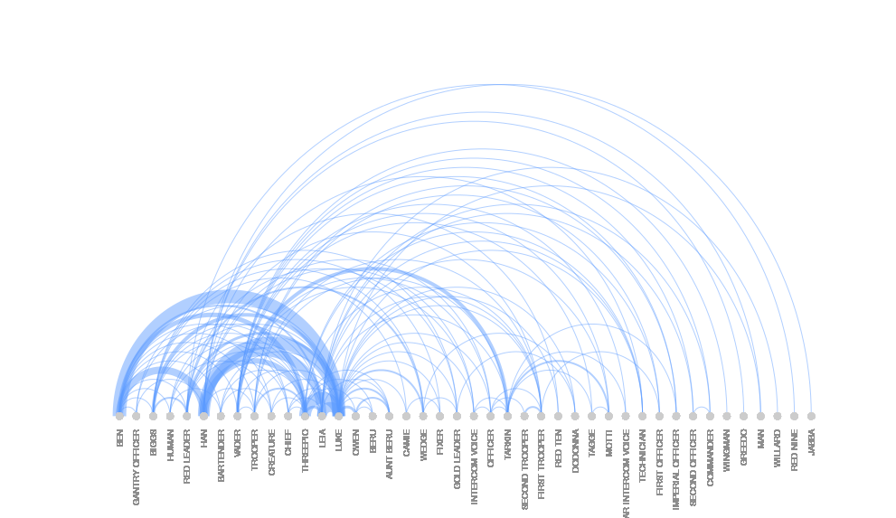

Star Wars: Episode IV - A New Hope
================
Irene Perez
16/5/2020

``` r
library(jsonlite)
library(arcdiagram)
```

## Relaciones entre los personajes

Los datos se obtuvieron de la base de datos
[Moviegalaxies](https://moviegalaxies.com/movies/view/773/star-wars-episode-iv-a-new-hope/#)
que contiene grafos de las redes sociales que se establecen dentro de
las películas. En este caso, he descargado el grafo de la película Star
Wars: Episode IV - A New Hope

``` r
new_hope <- fromJSON("../data/new_hope", flatten = TRUE)

new_hope_arc <- data.frame(matrix(ncol=0,nrow=124))
new_hope_arc$source <- new_hope$network$edges$source
new_hope_arc$target <- new_hope$network$edges$target
new_hope_arc$weight <- new_hope$network$edges$weight
new_hope_edges <- as.matrix(new_hope_arc[,c(1,2)])
```

``` r
arcplot(new_hope_edges, lwd.arcs=new_hope_arc$weight, cex.labels = 0.6, font = 1)
```

<!-- -->
