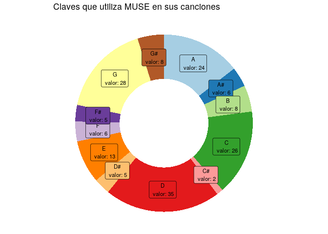
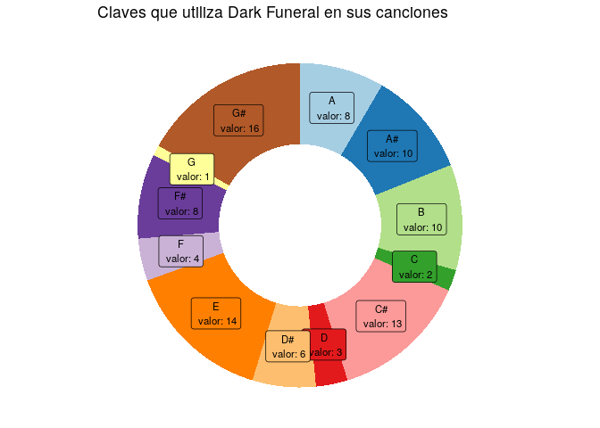

SpotifyR - Muse
================
Irene Perez
17/5/2020

``` r
library(spotifyr)
library(ggplot2)
```

## Uso de las diferentes claves en distintos grupo de música

Para este gráfico he decidido centrarme en dos artistas de estilos
diferentes: MUSE y Dark Funeral.

``` r
Sys.setenv(SPOTIFY_CLIENT_ID = 'XXXXXXXXXXXXXXXXXXXXXXXXXX')
Sys.setenv(SPOTIFY_CLIENT_SECRET = 'XXXXXXXXXXXXXXXXXXXXXXXXXXXX')
access_token <- get_spotify_access_token()
```

``` r
muse <- get_artist_audio_features("MUSE")
dark_funeral <- get_artist_audio_features("Dark funeral")
```

``` r
data <- data.frame(table(muse$key_name))
colnames(data) <- c("Claves", "Conteos")
# Calcular porcentajes
data$fraccion <- data$Conteos/ sum(data$Conteos)
# Calcular porcentajes cumulativos (la parte superior de cada rectángulo)
data$ymax <- cumsum(data$fraccion)
# Calcular la parte inferior de cada rectángulo
data$ymin <- c(0, head(data$ymax, n=-1))
# Calcular posicion de las etiquetas
data$posicionEtiqueta <- (data$ymax + data$ymin) /2
# Etiquetas
data$etiqueta <- paste0(data$Claves, "\n valor: ", data$Conteos)
```

``` r
ggplot(data, aes(ymax=ymax, ymin=ymin, xmax=4, xmin=3, fill=Claves)) +
  geom_rect() +
  geom_label( x=3.5, aes(y= posicionEtiqueta, label= etiqueta), size=3) +
  scale_fill_brewer(palette="Paired") +
  coord_polar(theta="y") +
  xlim(c(2, 4)) +
  theme_void() +
  theme(legend.position = "none") +
  labs(title="Claves que utiliza MUSE en sus canciones")
```

<!-- -->

``` r
data <- data.frame(table(dark_funeral$key_name))
colnames(data) <- c("Claves", "Conteos")
# Calcular porcentajes
data$fraccion <- data$Conteos/ sum(data$Conteos)
# Calcular porcentajes cumulativos (la parte superior de cada rectángulo)
data$ymax <- cumsum(data$fraccion)
# Calcular la parte inferior de cada rectángulo
data$ymin <- c(0, head(data$ymax, n=-1))
# Calcular posicion de las etiquetas
data$posicionEtiqueta <- (data$ymax + data$ymin) /2
# Etiquetas
data$etiqueta <- paste0(data$Claves, "\n valor: ", data$Conteos)
```

``` r
ggplot(data, aes(ymax=ymax, ymin=ymin, xmax=4, xmin=3, fill=Claves)) +
  geom_rect() +
  geom_label( x=3.5, aes(y= posicionEtiqueta, label= etiqueta), size=3) +
  scale_fill_brewer(palette="Paired") +
  coord_polar(theta="y") +
  xlim(c(2, 4)) +
  theme_void() +
  theme(legend.position = "none") +
  labs(title="Claves que utiliza Dark Funeral en sus canciones")
```

<!-- -->
