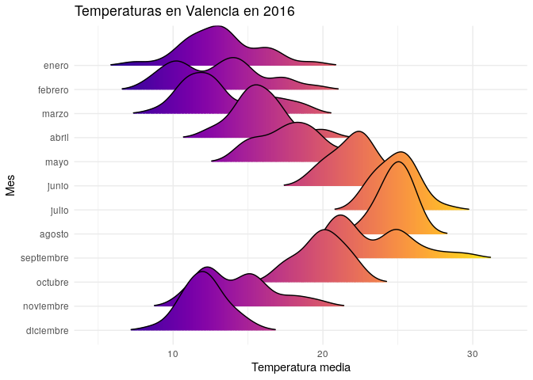

Temperaturas Valencia
================
Irene Perez
18/5/2020

``` r
library(ggridges)
library(ggplot2)
library(dplyr)
```

    ## 
    ## Attaching package: 'dplyr'

    ## The following objects are masked from 'package:stats':
    ## 
    ##     filter, lag

    ## The following objects are masked from 'package:base':
    ## 
    ##     intersect, setdiff, setequal, union

``` r
library(lubridate)
```

    ## 
    ## Attaching package: 'lubridate'

    ## The following object is masked from 'package:base':
    ## 
    ##     date

``` r
library(viridis)
```

    ## Loading required package: viridisLite

``` r
data <- read.csv("../data/clima2016.csv", sep = ";")

valencia <- data[,c("FECHA", "Temp.")]
colnames(valencia) <- c("Fecha", "Temperatura")
valencia <- valencia %>%
  mutate(Fecha = floor_date(as.Date(Fecha))) %>%
  group_by(Fecha) %>%
  summarize(media = mean(Temperatura))

valencia$Mes <- months(as.Date(valencia$Fecha))
meses <- c("enero", "febrero", "marzo", "abril", "mayo", "junio", "julio", "agosto", "septiembre", "octubre",
           "noviembre", "diciembre")
valencia$Mes <- factor(valencia$Mes, levels=rev(meses))
```

``` r
ggplot(valencia, aes(x = media, y = Mes, fill = ..x..)) +
  geom_density_ridges_gradient(scale = 3, rel_min_height = 0.01) +
  scale_fill_viridis(name = "Temp. [F]", option = "C") +
  labs(title = 'Temperaturas en Valencia en 2016') +
  xlab("Temperatura media") +
  theme_minimal() +
    theme(
      legend.position="none",
      panel.spacing = unit(0.1, "lines"),
      strip.text.x = element_text(size = 8)
    )
```

    ## Picking joint bandwidth of 0.872

<!-- -->
